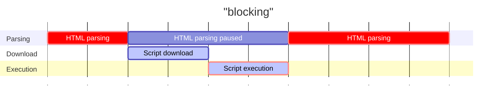
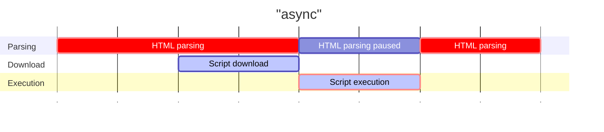
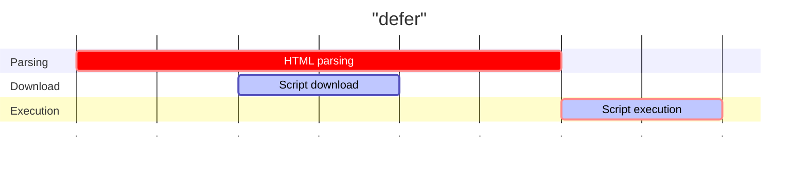

# `loadBehavior` option visualised

<- [[ Back to add-javascript README ](./README.md)]

```js
import { addScript, loadScript, makeHook } from "add-javascript";

addScript("https://www.example.com/script.js", {
  loadBehavior: "async" // or "defer" or "blocking"
});

await loadScript("https://www.example.com/script.js", {
  loadBehavior: "async" // or "defer" or "blocking"
});

const useScript = makeHook(React);
function Component() {
  useScript("https://www.example.com/script.js", {
    loadBehavior: "async" // or "defer" or "blocking"
  });
}
```

If the diagrams below aren't being rendered, view this page on [Github](https://github.com/shuckster/add-javascript/blob/master/LOADVIZ.md).







Props to [growingwiththeweb.com](https://www.growingwiththeweb.com/2014/02/async-vs-defer-attributes.html) for the original visualisation and [BBSS](https://www.bbss.dev/posts/eventloop/) for the inspiration to use Mermaid Gantt charts to represent them.
